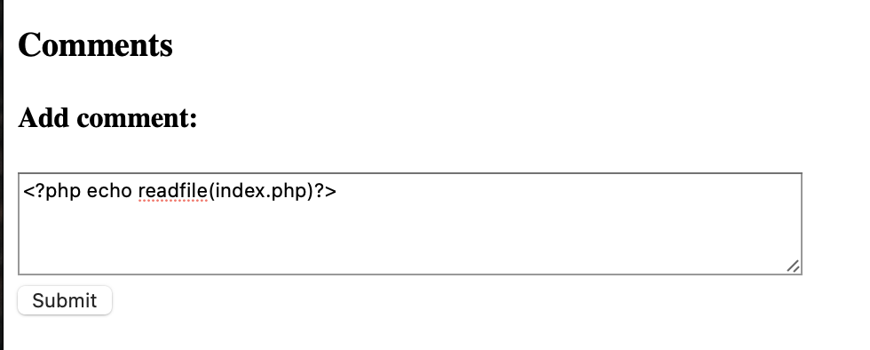

# Cody's First Blog

## Flag 1

Inspect Element reveals the page **admin.auth.inc**, admin:admin doesn't work.

Inserting **<?php phpinfo()?>** as a comment and posting it gives us the first flag.


## Flag 2
Removing **.auth** from the url takes us to the comment approval page, which contains the second flag.

## Flag 3
There should be an index page, and since the site uses PHP, the format should be ?/page=index.php.
Navigating there gives us the following result, which is a different response to using other files. The file exists.

Since a PHP oneliner worked to get the first flag, let's try to use another one to output the actual file (php is interpreted so when pointing at it, it would execute rather than showing its contents)

EDIT: the correct payload is ```<?php echo readfile("index.php") ?>```
Let's navigate to **?page=admin.inc** and approve the comment
Navigate to **?page=http://localhost/index**, the **.php** format will append automatically.
View the page's source, we'll find the flag
