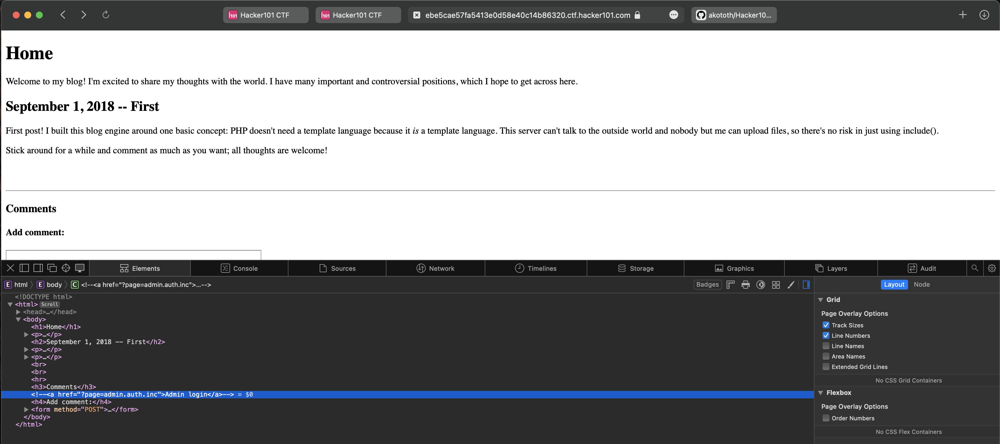
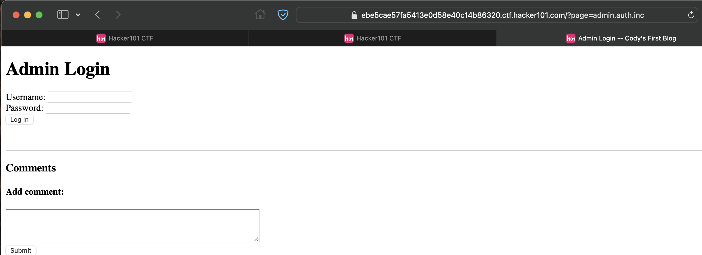
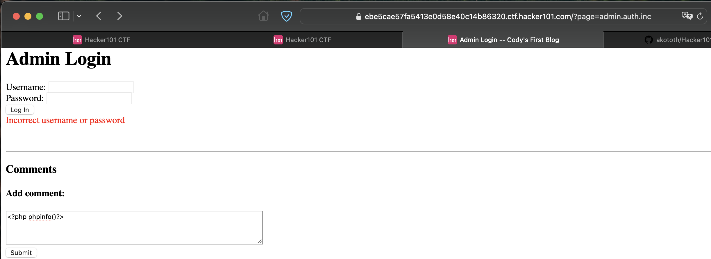
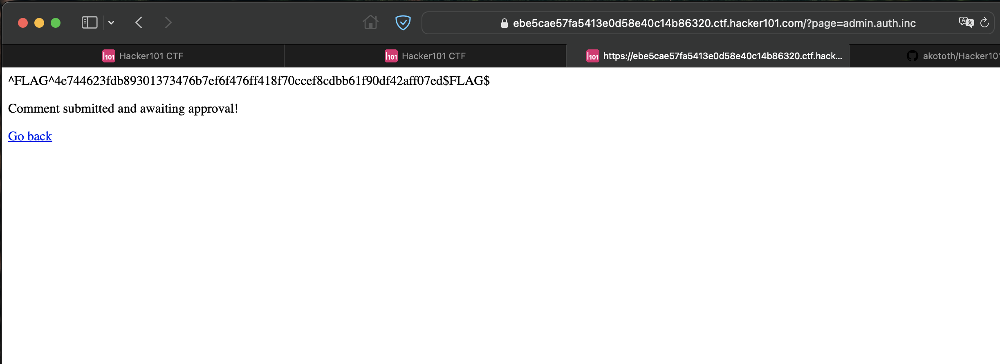

# Flag 1
https://ec980f8824c3c416b995aea996497976.ctf.hacker101.com/page/edit/6 -> flag

# Flag 2
create page and use XSS payload on title
 
when going back home, get flag

# Flag 3
on page 2, edit -> https://ec980f8824c3c416b995aea996497976.ctf.hacker101.com/page/edit/2

change the button to this:
<button onclick=alert("pwned")>Some button</button>

popup with alert appears, now go to source code and flag is there

# Flag 4
add a single quote on the edit url
https://ec980f8824c3c416b995aea996497976.ctf.hacker101.com/page/edit/2'

